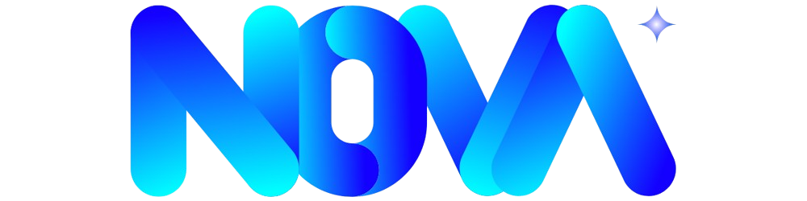
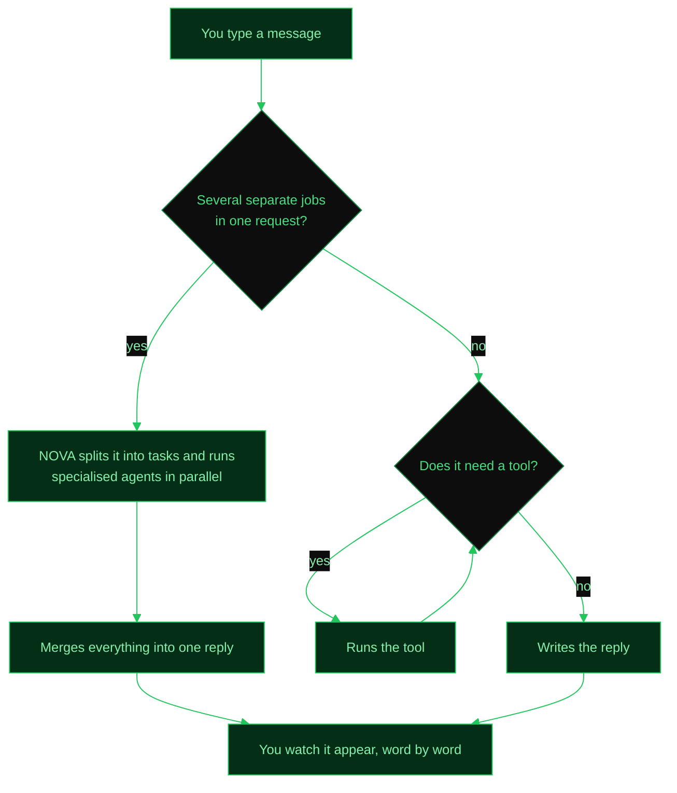

<div align="center">



# Neural Orchestration & Virtual Agent

An advanced conversational AI agent built with **LangGraph**, **FastAPI** and **React**.

[](https://www.linkedin.com/in/thisisrober)
[](https://github.com/thisisrober)
[](https://github.com/thisisrober/nova-agent/stargazers)

</div>

## What is NOVA?

NOVA is a smart AI assistant that can chat with you, search the web, run code, remember what
you told it last week, and act inside your own Gmail, calendar, files and GitHub repositories —
all from a web interface or your terminal.

It runs on a **local model through Ollama** by default, so nothing leaves your machine unless
you choose otherwise. OpenAI and Anthropic are selectable from the settings panel if you prefer
a cloud model.

## Features

- 🤖 **AI chat** — talk to NOVA in natural language; it figures out which tool to use
- 🔗 **Connected accounts** — sign in with Google, Microsoft or GitHub and it works in your real
  mail, calendar, Drive/OneDrive, spreadsheets, documents, repos, issues and pull requests
- 🧠 **Memory** — extracts facts from your conversations and recalls them in later ones
- 📚 **Knowledge base (RAG)** — upload PDFs, text and markdown; NOVA chunks, embeds and retrieves
- 🌐 **Web search** — real-time search via Tavily, with a DuckDuckGo fallback
- 🐍 **Code execution** — writes and runs Python in a sandboxed subprocess, self-healing on errors
- ⏰ **Scheduled tasks** — cron or interval jobs that run agent prompts on their own
- 🕸️ **Multi-agent (A2A)** — splits a request into a task graph, runs specialised agents in
  parallel, and shows the whole run as a live diagram
- 🔌 **MCP** — connects to external tool servers, and exposes its own tools to other agents
- ⚡ **Real-time streaming** — responses appear word-by-word, and can be stopped mid-flight
- 🎨 **Modern web UI** — React app with markdown, syntax highlighting, drag & drop, i18n
- ⚙️ **Runtime settings** — swap provider, model and temperature from the UI without restarting
- 🖥️ **CLI** — rich terminal interface with colored output and token stats
- 📊 **Token tracking** — per-message and cumulative usage

## Quick start

```bash
# 1. Clone the project
git clone https://github.com/thisisrober/nova-agent/ && cd nova-agent

# 2. Create your config file (the defaults work as-is for local use)
cp .env.example .env

# 3. Pull the models NOVA uses
ollama pull gemma3:4b          # chat model
ollama pull nomic-embed-text   # embeddings for RAG

# 4. Install everything
make install && make setup

# 5. Start both the API server and the web UI
make dev
```

Then open **http://localhost:5173** in your browser. That's it! 🎉

To let NOVA into your Google, Microsoft or GitHub account, open the sidebar →
**connections** and follow [docs/CONNECTIONS.md](docs/CONNECTIONS.md).

## Documentation

| Guide | What's in it |
|-------|--------------|
| [FAQ](docs/FAQ.md) | Short answers to the questions that come up most |
| [Setup](docs/SETUP.md) | Prerequisites, install, environment variables, run modes |
| [Capabilities](docs/CAPABILITIES.md) | What NOVA can actually do, capability by capability |
| [Connected services](docs/CONNECTIONS.md) | Registering the OAuth apps and signing in |
| [Architecture](docs/ARCHITECTURE.md) | Graph, nodes, state, storage layout |
| [Tools](docs/TOOLS.md) | Every tool, and how to write your own |
| [MCP](docs/MCP.md) | Client, server, and the per-account service servers |
| [Multi-agent (A2A)](docs/MULTI_AGENT.md) | Orchestration, execution budgets, retries, remote agents |
| [API reference](docs/API_REFERENCE.md) | Every REST endpoint with examples |
| [Memory & RAG](docs/MEMORY_RAG.md) | Facts, episodes, embeddings, retrieval |
| [Scheduler](docs/SCHEDULER.md) | Cron and interval tasks |

## How it works (the simple version)



1. You write something like _"What's 2^10?"_
2. NOVA's brain (a local Ollama model by default) reads your message
3. It decides: _"I need the calculator tool for this"_
4. The calculator runs and returns `1024`
5. NOVA writes a nice reply: _"2¹⁰ = 1024"_
6. You see the answer appear in real time, word by word

Ask for several things at once — _"book me a slot on Friday, research the
competition and draft a summary"_ — and NOVA plans the work as a task graph
instead, runs the independent parts across specialised agents at the same time,
and shows you that graph live while it happens. See
[docs/MULTI_AGENT.md](docs/MULTI_AGENT.md).

After the reply is sent, a background pass extracts anything worth remembering and stores it
for future conversations.

## Project structure

```
nova-agent/
├── agent/                  # The brain
│   ├── graph.py            #   LangGraph agent loop (agent ↔ tools)
│   ├── orchestrator.py     #   Supervisor: plan → execute → repair → aggregate
│   ├── nodes.py            #   LLM reasoning node & tool router
│   ├── state.py            #   Conversation state definition
│   ├── llm.py              #   Provider/model setup & runtime config
│   └── cli.py              #   Terminal chat interface
├── tools/                  # Things NOVA can do
│   ├── calculator.py       #   Math expressions (2+2, sqrt(144), etc.)
│   ├── code_executor.py    #   Sandboxed Python execution
│   ├── datetime_tool.py    #   Current time & timezone conversion
│   ├── files.py            #   Read CSV, Excel, text files, list folders
│   ├── rag_tool.py         #   Search the uploaded knowledge base
│   └── web_search.py       #   Tavily / DuckDuckGo search
├── connections/            # OAuth to Google / Microsoft / GitHub
│   ├── providers.py        #   Endpoints, scopes, env-var names
│   ├── oauth.py            #   Authorize URL, code exchange, refresh
│   ├── github_app.py       #   One-click GitHub App registration
│   ├── store.py            #   Encrypted persistence + auto-refresh
│   └── crypto.py           #   Fernet encryption at rest
├── memory/                 # Facts, episodes, and the RAG vector store
├── scheduler/              # APScheduler jobs, store and models
├── nova_mcp/               # Model Context Protocol (agent ↔ tools)
│   ├── server.py           #   Expose NOVA's tools to other apps
│   ├── client.py           #   Connect to external MCP tool servers
│   ├── servers/            #   Per-account servers: google, microsoft, github
│   └── builtin.py          #   Binds those same tools into the agent graph
├── nova_a2a/               # Agent-to-agent orchestration
│   ├── planner.py          #   Request → task DAG, and repairs when tasks fail
│   ├── executor.py         #   Runs the DAG in waves, with retries and cancel
│   ├── worker.py           #   Runs one task, locally or on a remote peer
│   ├── agents/             #   The specialists: research, calendar, mail, docs, github, advisor
│   ├── budget.py           #   Per-task limits: steps, tools, time, repeats
│   └── aggregator.py       #   Merges the agents' results into one answer
├── api/                    # REST API (backend)
│   ├── main.py             #   FastAPI app with MCP lifecycle
│   ├── routes.py           #   Chat, streaming, settings, history endpoints
│   ├── routes_connections.py #  OAuth connect / disconnect / setup
│   └── schemas.py          #   Request/response models
├── ui/                     # Web interface (frontend)
│   ├── src/
│   │   ├── App.tsx         #   Main app shell
│   │   ├── components/     #   React components (chat, connections, settings)
│   │   ├── hooks/          #   useChat (streaming), useConnections, useTheme
│   │   └── lib/            #   API client, types, i18n, utilities
│   ├── package.json        #   Node.js dependencies
│   └── vite.config.ts      #   Vite build config with API proxy
├── docs/                   # The guides linked above
├── mcp_servers.json        # External MCP servers to connect to
├── pyproject.toml          # Python dependencies
├── Makefile                # All the commands you need
├── .env.example            # Template for your config
└── README.md               # You are here!
```

## Available commands

All commands live in the `Makefile`:

| Command | What it does |
|---------|-------------|
| `make install` | Install all Python and Node.js dependencies |
| `make setup` | Same as install + add the `nova` shortcut to your terminal |
| `make dev` | Start both the API and the web UI at the same time |
| `make api` | Start only the FastAPI backend (port 8000) |
| `make ui` | Start only the React frontend (port 5173) |
| `make run` | Run the terminal chat (CLI mode) |
| `make mcp` | Start the MCP server (stdio transport) |
| `make mcp-http` | Start the MCP server (HTTP transport) |
| `make mcp-google` | Start the Google (Gmail/Calendar/Drive) MCP server |
| `make mcp-microsoft` | Start the Microsoft (Outlook/Calendar/OneDrive) MCP server |
| `make mcp-github` | Start the GitHub (repos/issues/PRs) MCP server |
| `make test` | Run the test suite |
| `make clean` | Remove caches and build artifacts |

## Configuration

Copy `.env.example` to `.env` and fill in your values:

```env
# Which brain to use — no API key needed for the default
NOVA_PROVIDER=ollama             # ollama | openai | anthropic
NOVA_MODEL_NAME=gemma3:4b        # model name for the chosen provider
NOVA_TEMPERATURE=0.7             # 0.0 = precise, 2.0 = very creative
NOVA_NUM_CTX=16384               # Ollama context window — lower breaks tool calls

# Only needed for the cloud providers
OPENAI_API_KEY=sk-proj-...
ANTHROPIC_API_KEY=sk-ant-...

# Connected services (see docs/CONNECTIONS.md)
NOVA_PUBLIC_URL=http://localhost:5173   # every OAuth redirect URI is built from this
NOVA_ENCRYPTION_KEY=                    # Fernet key; auto-generated if left blank

# Optional
TAVILY_API_KEY=                  # better web search than the DuckDuckGo fallback
MCP_TRANSPORT=http               # MCP server transport: stdio or http
```

You can also change the provider, model and temperature **from the web UI** at any time (click
the ⚙️ Settings button in the sidebar). OAuth client ids and secrets are *not* set here — enter
them in the connections setup wizard, which stores them encrypted.

## External MCP servers

NOVA can connect to external tool servers using the [Model Context Protocol](https://modelcontextprotocol.io/). Configure them in `mcp_servers.json`:

```json
{
  "langchain-docs": {
    "url": "https://docs.langchain.com/mcp",
    "transport": "streamable_http"
  }
}
```

This gives NOVA a `SearchDocsByLangChain` tool — it can search the LangChain documentation to answer your questions about LangChain.

To add more MCP servers, just add entries to the JSON file and restart the API.

## Tools

Always available:

| Tool | What it does | Example |
|------|-------------|---------|
| `calculator` | Evaluate math expressions | _"What's sqrt(144) + 3^2?"_ → 21 |
| `web_search` | Search the web | _"What changed in Python 3.13?"_ |
| `execute_python` | Run Python in a sandbox | _"Plot these numbers and give me the mean"_ |
| `rag_search` | Query your uploaded documents | _"What does the contract say about notice?"_ |
| `get_current_datetime` | Get current date and time | _"What time is it in Tokyo?"_ |
| `convert_timezone` | Convert between timezones | _"Convert 3pm EST to CET"_ |
| `list_directory` | List files in a folder | _"What files are in /home/user?"_ |
| `read_csv` / `read_excel` / `read_text_file` | Read local files | _"Show me the sales.csv data"_ |
| `count_tokens` | Count tokens in the conversation | _"How much context am I using?"_ |

Bound only while the matching account is connected — see [docs/CONNECTIONS.md](docs/CONNECTIONS.md):

| Service | Tools | Example |
|---------|-------|---------|
| Google (11) | Gmail, Calendar, Drive, Sheets, Docs | _"Summarise this morning's unread mail"_ |
| Microsoft (8) | Outlook, Calendar, OneDrive | _"Move my 4pm to Thursday"_ |
| GitHub (9) | Repos, files, commits, issues, PRs | _"Open an issue about the login bug"_ |

## Tech stack

| Layer | Technology |
|-------|-----------|
| **LLM** | Ollama (local, default), or OpenAI / Anthropic via `langchain-*` |
| **Orchestration** | LangGraph + LangChain (ReAct agent, plus an A2A supervisor graph) |
| **Backend** | FastAPI + Uvicorn (async REST API with SSE streaming) |
| **Frontend** | React 19 + TypeScript + Vite 7 + Tailwind CSS v4 |
| **Memory** | SQLite (aiosqlite) + ChromaDB for embeddings |
| **Scheduling** | APScheduler |
| **Connections** | OAuth 2.0 + Fernet-encrypted token storage |
| **Animations** | Framer Motion |
| **Markdown** | react-markdown + remark-gfm + rehype-highlight |
| **MCP** | langchain-mcp-adapters (client) + FastMCP (server) |
| **Token counting** | tiktoken |
| **Package manager** | uv (Python) + npm (Node.js) |

## License

MIT

---

<div align="center">
  Made with ❤️ by <a href="https://thisisrober.es">thisisrober</a>
</div>
