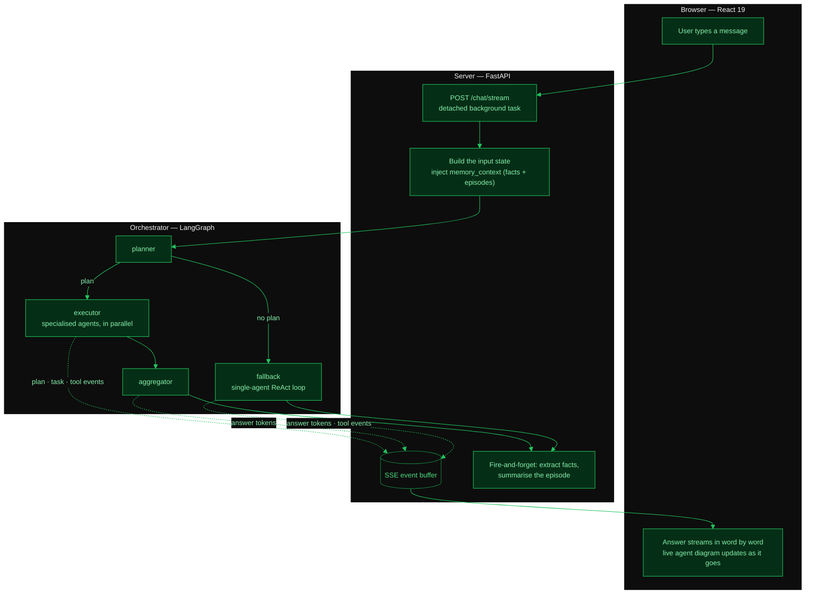
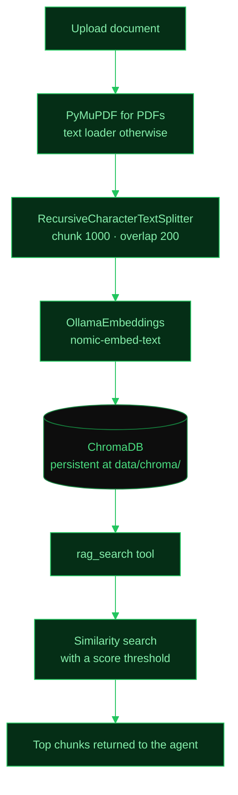

# Architecture

## Overview

NOVA follows a **ReAct** (Reasoning + Acting) pattern powered by **LangGraph**. The system has four layers:

1. **Frontend** -- React 19 + Vite 7 + Tailwind CSS 4 web app where the user interacts via chat
2. **Backend** -- FastAPI server (uvicorn) that manages sessions, streams responses, and exposes the REST endpoints
3. **Orchestrator** -- a supervisor graph that decides whether a request is worth splitting across specialised agents, and runs them if so
4. **Agent** -- LangGraph state machine that reasons, calls tools, and uses Ollama as the local LLM backend

Layers 3 and 4 are alternatives, not a stack. Every turn enters the
orchestrator; a request it declines to split falls through to the single-agent
graph described in this document, which is the path most turns take. See
[Multi-agent](MULTI_AGENT.md) for the other one.

## Message Flow



Both the SSE event buffer and the LLM token callback reach the graph through
LangGraph's runtime `config`, which is why every node in `agent/orchestrator.py`
annotates its `config` parameter as `Optional[RunnableConfig]` and nothing else:
LangGraph matches that annotation literally and passes `None` for any other
spelling, which costs the live diagram and the streamed answer at once.

## Agent State (`NOVAState`)

The agent keeps a state dictionary (`NOVAState`) that travels through every node:

| Field | Type | Purpose |
|-------|------|---------|
| `messages` | `list[BaseMessage]` | Full conversation history (human, AI, tool) |
| `memory_context` | `str` | Injected context from long-term memory (facts + recent episodes) |
| `tool_results` | `list[str]` | Raw tool outputs |
| `iteration_count` | `int` | How many times the agent has looped |
| `total_tokens` | `int` | Cumulative token usage |
| `token_usage` | `dict` | Last turn's prompt/completion/total tokens |

## Orchestrator Nodes (in `agent/orchestrator.py`)

The supervisor graph every turn enters first. It owns the decision of *how many
agents* a request deserves; the single-agent graph below owns what one agent
does with its tools.

### `planner_node`

Turns the request — plus a bounded slice of the conversation, so a follow-up
like "and now the same for Friday" is plannable at all — into a DAG of tasks,
each naming a *skill* rather than an agent. Returning fewer than two tasks is
how it declines: one task is not orchestration, it is a detour, and the run
routes to `fallback` instead.

### `executor_node`

Runs the DAG in dependency waves, so independent tasks overlap rather than
queue. Each task executes under its own budget and reports its lifecycle
through the SSE event sink, which is what draws the live diagram in the chat.

### `repair_node`

Asks the planner for a *different* approach to whatever failed, once
(`MAX_REPAIR_ROUNDS`). Tasks that already succeeded keep their artifacts and
are never re-run.

### `aggregator_node`

Merges the workers' artifacts into the single reply the user reads — and this
is the node whose LLM call streams, so the answer types itself out. It has no
tools on purpose: everything that could act has already acted.

### `fallback_node`

Invokes the single-agent graph as a subgraph, rather than reimplementing it.
Memory injection, knowledge-base retrieval and the invented-tool recovery all
live there, and a request that skipped planning deserves every one of them.

## Graph Nodes (the single-agent graph)

### `agent_node` (in `agent/nodes.py`)

1. Gets the LLM singleton from `agent/llm.py`
2. Calls `get_tools()` which returns 11 local tools + any loaded MCP tools
3. Binds tools to the LLM (`llm.bind_tools(tools)`)
4. Sends `SYSTEM_PROMPT` + `memory_context` + full message history to the LLM
5. Returns the AI response + token usage

### `should_use_tools` (router)

Looks at the last message. If it has `tool_calls` -> go to `tools` node. Otherwise -> end.

### `tools` node (LangGraph `ToolNode`)

Executes whatever tool the LLM requested and returns the result as a `ToolMessage`. Control goes back to `agent_node` so the LLM can use the result.

### Graph rebuild on MCP tool changes

The graph is compiled lazily. When `set_mcp_tools()` is called (at API startup), the graph recompiles with the new tools so the `ToolNode` can execute them. A `_GraphProxy` object ensures existing references always point to the latest compiled graph.

## Tool Registry

NOVA ships with 11 local tools plus dynamically loaded MCP tools:

| Tool | Module | Description |
|------|--------|-------------|
| `get_current_datetime` | `tools/datetime_tool.py` | Current date/time in any timezone |
| `convert_timezone` | `tools/datetime_tool.py` | Convert datetime between timezones |
| `calculator` | `tools/calculator.py` | Evaluate math expressions safely |
| `list_directory` | `tools/files.py` | List files in a directory |
| `read_csv` | `tools/files.py` | Read CSV files into text |
| `read_excel` | `tools/files.py` | Read Excel files into text |
| `read_text_file` | `tools/files.py` | Read plain text / code files |
| `count_conversation_tokens` | `tools/conversation_tokens.py` | Count tokens in current conversation |
| `rag_search` | `tools/rag_tool.py` | Query ChromaDB for relevant document chunks |
| `web_search` | `tools/web_search.py` | Search the web (Tavily + DuckDuckGo fallback) |
| `execute_python` | `tools/code_executor.py` | Run Python code in a sandboxed subprocess (conditional on `CODE_EXEC_MODE`) |

MCP tools are loaded at startup from configured MCP servers via `nova_mcp/client.py` and merged into the tool registry.

## Memory System

The memory module (`memory/`) provides long-term context that persists across conversations.

### Storage

All memory is stored in SQLite (`data/nova_memory.db`) via `aiosqlite`.

### Memory Types

- **Semantic memory** -- Facts extracted by the LLM from conversations (e.g., "User prefers dark mode"). Stored as key-value facts in SQLite.
- **Episodic memory** -- Conversation summaries generated after each chat. Stored with timestamps for recency-based retrieval.

### Memory Context Injection

Before the agent processes a message, the system:

1. Retrieves relevant semantic facts
2. Retrieves recent episodic summaries
3. Formats them into a `memory_context` string
4. Passes `memory_context` as part of the agent state

### Fire-and-Forget Extraction

After each chat response is sent, an `asyncio.create_task()` fires off background work to:

- Extract new semantic facts from the conversation
- Generate an episodic summary of the exchange

This avoids blocking the response stream.

### Memory Modules

| Module | Responsibility |
|--------|---------------|
| `memory/__init__.py` | Singleton facade for the memory subsystem |
| `memory/database.py` | SQLite connection and schema management via aiosqlite |
| `memory/episodic.py` | Episodic memory storage and retrieval |
| `memory/conversation.py` | Conversation-level memory operations and context formatting |

## RAG Pipeline

NOVA includes a fully offline Retrieval-Augmented Generation pipeline.



- **Vector store**: ChromaDB, in-process, persistent at `data/chroma/`
- **Embeddings**: `nomic-embed-text` via `OllamaEmbeddings` (fully offline, no API keys)
- **Ingestion**: PyMuPDF for PDFs, `RecursiveCharacterTextSplitter` with chunk size 1000 and overlap 200
- **Retrieval**: Similarity search with score threshold filtering

### RAG Modules

| Module | Responsibility |
|--------|---------------|
| `memory/rag/store.py` | ChromaDB vector store initialization and management |
| `memory/rag/ingestion.py` | Document loading, splitting, and embedding |
| `memory/rag/retriever.py` | Similarity search and chunk retrieval |

## Web Search

- **Primary**: Tavily search (requires `TAVILY_API_KEY` env var)
- **Fallback**: DuckDuckGo search (no API key required)
- The `web_search` tool tries Tavily first; if the key is missing or the call fails, it falls back to DuckDuckGo
- Returns formatted search results with titles, snippets, and URLs

Module: `tools/web_search.py`

## Code Execution

Sandboxed Python code execution with security restrictions:

- Runs in a **subprocess** with `python -I` (isolated mode -- no user site packages, no env vars)
- **Import blocklist**: `os`, `subprocess`, `sys`, `shutil`, and other dangerous modules are rejected
- **Timeout**: Default 30 seconds, configurable
- **Temp CWD**: Each execution runs in a temporary working directory
- **Configuration**: Controlled by `CODE_EXEC_MODE` env var:
  - `"subprocess"` -- enabled (default)
  - `"disabled"` -- tool is not registered

Module: `tools/code_executor.py`

## Scheduled Tasks

NOVA supports recurring and one-off scheduled tasks via APScheduler.

- **Scheduler**: `AsyncIOScheduler` with `SQLAlchemyJobStore`
- **Storage**: SQLite at `data/nova_scheduler.db`
- **Triggers**: Cron expressions and interval-based triggers
- **Execution**: Each scheduled task calls `run_agent_once()` with the task's prompt, running through the full agent pipeline
- **Logging**: Execution logs record duration, status (success/failure), and result text
- **Lifespan**: Scheduler is started during FastAPI app startup and shut down on app shutdown (managed in `api/main.py`)

### Scheduler Modules

| Module | Responsibility |
|--------|---------------|
| `scheduler/__init__.py` | Singleton scheduler instance |
| `scheduler/models.py` | Pydantic models for tasks, triggers, and execution logs |
| `scheduler/store.py` | SQLite persistence for task definitions and execution logs |
| `scheduler/manager.py` | APScheduler lifecycle, job registration, and execution |

## Data Storage Layout

NOVA does **not** use a single database. Each kind of data lives in the store
best suited to it, and everything is local to the machine (no cloud database).

| Data | Where | Technology | Path | Env override |
|------|-------|------------|------|--------------|
| **Chat message history** | JSON file per session (also cached in RAM) | Plain files | `data/sessions/<session_id>.json` | — |
| **User facts** (name, preferences…) | `facts` table | SQLite (`aiosqlite`) | `data/nova_memory.db` | `MEMORY_DB_PATH` |
| **Episodic memory** (session summaries) | `episodes` table | SQLite (`aiosqlite`) | `data/nova_memory.db` | `MEMORY_DB_PATH` |
| **Document metadata** (name, status, chunk count) | `documents` table | SQLite (`aiosqlite`) | `data/nova_memory.db` | `MEMORY_DB_PATH` |
| **Knowledge base** (RAG chunks + embeddings) | `nova_documents` collection | ChromaDB vector store | `data/chroma/` | `CHROMA_PERSIST_DIR` |
| **Uploaded source documents** | Raw files | Plain files | `data/uploads/` | — |
| **Scheduled tasks + run logs** | `scheduled_tasks`, `task_executions` tables | SQLite (`aiosqlite`) | `data/nova_scheduler.db` | `SCHEDULER_DB_PATH` |

```
data/
  sessions/           # Chat message history — one JSON file per session
  nova_memory.db      # SQLite: facts + episodes + document metadata
  chroma/             # ChromaDB vector store (RAG embeddings)
  uploads/            # Uploaded documents for RAG ingestion
  nova_scheduler.db   # SQLite: scheduler tasks + execution logs
```

**Notes**

- The **chat history sidebar list** (titles, folders) is kept in the browser's
  `localStorage`; the full message content of each session is what lives in
  `data/sessions/`. Selecting a session in the UI fetches it via
  `GET /chat/history/{session_id}`.
- **Authentication** (production only) is handled by AWS Cognito — NOVA keeps
  no local user/account database.

## API Layer

- **App factory**: `create_app()` in `api/main.py` with async lifespan managing:
  - Memory subsystem initialization
  - MCP tool loading from configured servers
  - Scheduler start and shutdown
- **Middleware**: `CorrelationIdMiddleware` for request tracing
- **Logging**: `structlog` for structured, correlation-aware logging
- **Health**: Enhanced `/health` endpoint reporting subsystem status (scheduler, memory, Ollama connectivity)

### REST Routes

Forty endpoints under `/api/v1`, plus `GET /health` and the two A2A endpoints
that RFC 8615 pins to the origin. [API_REFERENCE.md](API_REFERENCE.md) documents
each one with examples.

| Group | Endpoints |
|-------|-----------|
| Chat | `POST /chat`, `POST /chat/stream`, `POST /chat/stop/{id}`, `POST /chat/title` |
| History | `GET /chat/history`, `GET /chat/history/{id}`, `DELETE /chat/history/{id}` |
| Settings | `GET /settings`, `PUT /settings`, `POST /providers/test` |
| Ollama | `GET /ollama/models`, `GET /ollama/status`, `POST /ollama/start`, `GET /ollama/catalog`, `POST /ollama/pull` |
| System | `GET /system/metrics` |
| Memory | `GET /memory/facts`, `DELETE /memory/facts`, `GET /memory/episodes`, `DELETE /memory/episodes` |
| Documents | `POST /documents/upload`, `GET /documents`, `GET /documents/{id}`, `DELETE /documents/{id}` |
| Scheduler | `GET|POST /scheduler/tasks`, `GET|PUT|DELETE /scheduler/tasks/{id}`, `GET /scheduler/tasks/{id}/logs` |
| Connections | `GET /connections`, `POST /connections/{provider}/authorize`, `GET /connections/{provider}/callback`, `PUT|DELETE /connections/{provider}/credentials`, `DELETE /connections/{provider}`, the two GitHub App setup routes |
| Multi-agent | `GET /agents` |
| GitHub | `GET /github/roadmap` |
| Origin | `GET /health`, `GET /.well-known/agent-card.json`, `POST /a2a` |

## Key Modules

| Module | Responsibility |
|--------|---------------|
| `agent/graph.py` | Build LangGraph, manage tool registry, lazy graph compilation |
| `agent/nodes.py` | LLM reasoning node, tool routing, memory context injection |
| `agent/state.py` | `NOVAState` TypedDict with `add_messages` reducer |
| `agent/llm.py` | LLM singleton (Ollama, OpenAI or Anthropic) + runtime reconfiguration |
| `agent/logging_config.py` | structlog configuration and correlation ID propagation |
| `api/main.py` | FastAPI app factory, CORS, lifespan (memory, MCP, scheduler) |
| `api/routes.py` | Chat, streaming, history, settings, Ollama, system metrics, memory, documents, scheduler |
| `api/schemas.py` | Pydantic request/response models |
| `api/middleware.py` | CorrelationIdMiddleware for request tracing |
| `memory/__init__.py` | Singleton facade for the memory subsystem |
| `memory/database.py` | SQLite connection and schema management via aiosqlite |
| `memory/episodic.py` | Episodic memory (conversation summaries) |
| `memory/conversation.py` | Conversation-level memory ops and context formatting |
| `memory/rag/store.py` | ChromaDB vector store initialization |
| `memory/rag/ingestion.py` | Document loading, chunking, and embedding |
| `memory/rag/retriever.py` | Similarity search and retrieval |
| `tools/calculator.py` | Safe math expression evaluation |
| `tools/datetime_tool.py` | Current datetime and timezone conversion |
| `tools/files.py` | Directory listing, CSV/Excel/text file reading |
| `tools/conversation_tokens.py` | Token counting for conversations |
| `tools/rag_tool.py` | RAG search tool (queries ChromaDB) |
| `tools/web_search.py` | Web search (Tavily + DuckDuckGo fallback) |
| `tools/code_executor.py` | Sandboxed Python execution via subprocess |
| `scheduler/__init__.py` | Singleton scheduler instance |
| `scheduler/models.py` | Task and execution log Pydantic models |
| `scheduler/store.py` | SQLite persistence for scheduler |
| `scheduler/manager.py` | APScheduler lifecycle and job management |
| `nova_mcp/client.py` | Load tools from external MCP servers |
| `nova_mcp/server.py` | Expose NOVA tools via MCP protocol |
| `agent/orchestrator.py` | Supervisor graph: plan → execute → repair → aggregate, with the single-agent fallback |
| `nova_a2a/planner.py` | Request → task DAG, and repair plans when tasks fail |
| `nova_a2a/executor.py` | Runs the DAG in dependency waves, with retries and cancellation |
| `nova_a2a/worker.py` | Executes one task, locally or by dispatching to a peer |
| `nova_a2a/budget.py` | Per-task execution budget (steps, tools, time, repeats) and retry policy |
| `nova_a2a/registry.py` | Skill → agent index; discovers remote peers from their Agent Cards |
| `nova_a2a/client.py` | Outbound A2A `message/send` to a remote agent |
| `nova_a2a/aggregator.py` | Merges the workers' artifacts into one answer |
