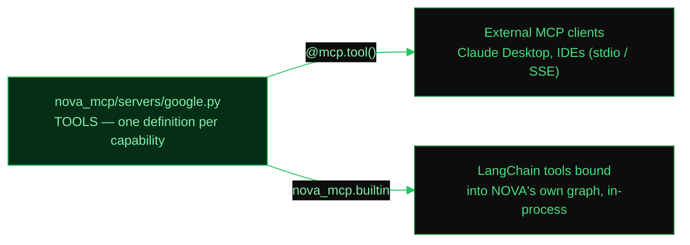

# MCP — Model Context Protocol

## What is MCP?

MCP is an open standard (created by Anthropic) that lets AI tools talk to each other. Think of it like USB for AI tools — one standard plug that works everywhere.

NOVA uses MCP in three ways:

1. **As a server** — NOVA exposes its tools (calculator, file reader, etc.) so _other_ apps can use them
2. **As a client** — NOVA connects to _external_ MCP servers to get _more_ tools (like searching LangChain docs)
3. **As connected-service servers** — one MCP server per external account (Google, Microsoft, GitHub) that acts on the user's behalf using the OAuth connection from the connections panel

## NOVA as MCP Client (connecting to external tools)

### How it works

When the API server starts, it:

1. Reads `mcp_servers.json` from the project root
2. Connects to each server listed there
3. Downloads the available tools
4. Adds them to the agent's tool belt (alongside calculator, file reader, etc.)

### Configuration

Edit `mcp_servers.json`:

```json
{
  "langchain-docs": {
    "url": "https://docs.langchain.com/mcp",
    "transport": "streamable_http"
  }
}
```

Each entry has:
- **key** — a name you choose (e.g. `"langchain-docs"`)
- **url** — the MCP server URL
- **transport** — how to connect: `"streamable_http"` for web servers, `"stdio"` for local commands

### Local command-based servers

You can also connect to MCP servers that run as local commands:

```json
{
  "filesystem": {
    "command": "npx",
    "args": ["-y", "@modelcontextprotocol/server-filesystem", "/home/user"],
    "transport": "stdio"
  }
}
```

### Code

- `nova_mcp/client.py` — `load_mcp_tools()` reads the config and returns LangChain tools
- `api/main.py` — calls `load_mcp_tools()` at startup and registers them in the agent graph

## NOVA as MCP Server (exposing tools to others)

### What it exposes

| Tool | Description |
|------|-------------|
| `calculator` | Evaluate math expressions |
| `get_current_datetime` | Get current date/time in any timezone |
| `convert_timezone` | Convert time between timezones |
| `read_csv` | Read CSV files |
| `read_excel` | Read Excel files |
| `read_text_file` | Read text/code files |

### Running the server

```bash
# For local integrations (IDE plugins, etc.)
make mcp

# For remote access (other machines, web apps)
make mcp-http
```

### Code

- `nova_mcp/server.py` — uses FastMCP to expose tools
- Transport controlled by `MCP_TRANSPORT` env var (`stdio` or `http`)

## Connected-service MCP servers

Three further servers act on the user's own accounts. They read the OAuth
tokens stored by the connections panel (see [CONNECTIONS.md](CONNECTIONS.md)),
so there is nothing to configure per server.

| Server | Module | Tools |
|--------|--------|-------|
| `nova-google` | `nova_mcp/servers/google.py` | Gmail list/read/send, Calendar list/create/update/delete, Drive list, Sheets create/append, Docs create |
| `nova-microsoft` | `nova_mcp/servers/microsoft.py` | Outlook list/read/send, Calendar list/create/update/delete, OneDrive list |
| `nova-github` | `nova_mcp/servers/github.py` | Repos list/create, file read, issues list/read/create/comment, pull requests list |

```bash
make mcp-google
make mcp-microsoft
make mcp-github
```

### How the agent uses them

The servers are real MCP servers — point Claude Desktop or an IDE at them and
they work. NOVA's own agent, however, runs in the same process, so routing its
calls through an MCP transport would add a process spawn and serialisation to
every tool call for no benefit.

`nova_mcp/builtin.py` therefore binds *the same functions* as LangChain tools.
There is one definition per capability: the MCP server registers it for
external clients, the bridge binds it for the local agent.



Only services the user is **signed into** contribute tools. This is a hard
requirement, not an optimisation: tool schemas are large, and two dozen of them
fill a local model's context window on their own, pushing out the system prompt
and the conversation history. `agent.graph.reload_service_tools()` re-binds them
and rebuilds the graph on connect, disconnect and credential changes, with no
restart.

> Ollama's own default context window is 2048 tokens, far too small for this.
> `NOVA_NUM_CTX` therefore defaults to 16384 — see `agent/llm.py`.

### Behaviour when a service is not connected

`connections/prompt.py` injects the live connection state into the system
prompt each turn. A service listed as `NOT CONNECTED` has no tools bound, and
the accompanying rule tells the agent to say so plainly rather than improvise
("no puedo hacerlo porque no tienes la sesión iniciada con Google").

As a second line of defence, every tool still resolves its access token at call
time. If the grant was revoked between binding and the call, the tool returns a
`NOT_CONNECTED:` or `AUTH_EXPIRED:` instruction instead of raising.

The same block is what lets the agent disambiguate: with both
Google and Microsoft connected, a bare "send an email" makes it ask which
service to use; with only one connected it just uses that one.
