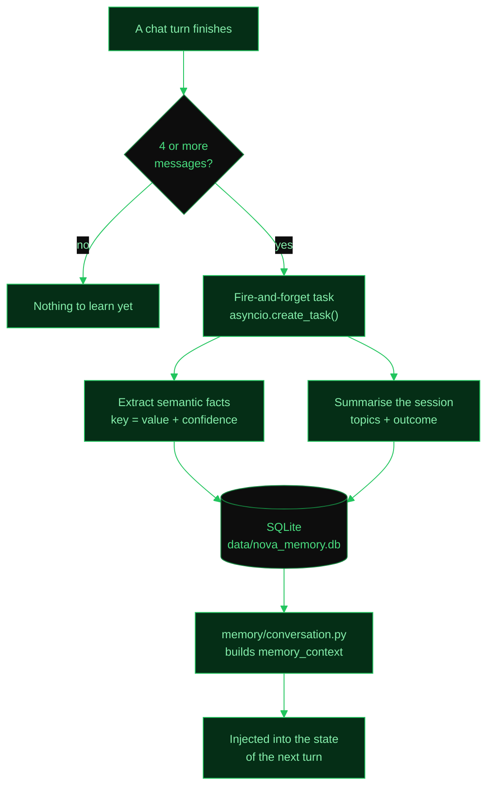

# Memory System and RAG Pipeline

## Memory System

### Architecture

NOVA uses two types of long-term memory, both stored in SQLite (`data/nova_memory.db` via `aiosqlite`):

**Semantic Facts**

Key-value pairs extracted by the LLM from conversations. Examples:

- `user_name=Roberto`
- `preferred_language=Python`

Each fact is stored with a confidence score and the source session ID.

**Episodic Memory**

Summaries of conversations including key topics and message counts. One episode is created per session.

### The memory loop

### Memory Extraction

Memory extraction runs as a fire-and-forget task (`asyncio.create_task`) after every chat response where the conversation has 4 or more messages. The LLM analyzes the conversation and:

1. Extracts semantic facts (key-value pairs with confidence scores).
2. Creates an episode summary capturing the main topics and outcome.

### Context Injection

Before each agent turn, `memory/conversation.py` builds a `memory_context` string containing:

- Relevant semantic facts
- Recent episode summaries

This string is injected into the agent state so the LLM has access to prior knowledge.

### API Endpoints

| Method | Endpoint | Description |
|--------|----------|-------------|
| GET | `/api/v1/memory/facts` | List all stored facts |
| DELETE | `/api/v1/memory/facts` | Clear all facts |
| GET | `/api/v1/memory/episodes` | List all episodes |
| DELETE | `/api/v1/memory/episodes` | Clear all episodes |

### UI

The Memory Manager is accessible via a modal in the sidebar. It displays facts and episodes in separate tabs, each with a clear button to delete all entries.

---

## RAG Pipeline

### Vector Store

ChromaDB runs in-process with persistent storage at `data/chroma/`. All documents are stored in the `"nova_documents"` collection.

### Embeddings

- Model: `nomic-embed-text` via `OllamaEmbeddings`
- Dimensions: 768
- Fully offline, no API key required

### Document Ingestion

Documents can be uploaded via the API or the UI. Supported formats:

| Format | Parser |
|--------|--------|
| PDF | PyMuPDF |
| TXT | Plain text |
| MD | Markdown |

Maximum file size: 50 MB.

### Chunking

Uses `RecursiveCharacterTextSplitter` with:

- `chunk_size=1000`
- `chunk_overlap=200`

Metadata is preserved per chunk: `source`, `doc_id`, `chunk_index`.

### Document Tracking

The `documents` table in `nova_memory.db` tracks each uploaded document:

| Field | Description |
|-------|-------------|
| `id` | Unique document identifier |
| `name` | Original filename |
| `file_type` | pdf, txt, or md |
| `size_bytes` | File size |
| `chunk_count` | Number of chunks created |
| `status` | One of: pending, processing, ready, error |

### Retrieval

Retrieval happens two ways:

1. **Automatic injection (retrieve-then-read)** — On every user turn, the agent
   (`agent/nodes.py`) runs a similarity search against the knowledge base using
   the user's message and injects the most relevant excerpts into the system
   prompt, right after the memory context. This does **not** depend on the LLM
   deciding to call a tool, so even small local models "see" the user's
   documents. Chunks farther than `RAG_CONTEXT_MAX_DISTANCE` (cosine distance)
   are treated as irrelevant and skipped; up to `RAG_CONTEXT_CHUNKS` are
   injected. When the base is empty, nothing is injected.
2. **`rag_search` tool** — The agent can also explicitly query the knowledge
   base for follow-up searches. Returns the top matching chunks with source
   information (document name, chunk index).

### Configuration

| Variable | Description | Default |
|----------|-------------|---------|
| `RAG_CONTEXT_CHUNKS` | Max excerpts auto-injected per turn | `4` |
| `RAG_CONTEXT_MAX_DISTANCE` | Max cosine distance (0–2) to count as relevant | `0.6` |

> The default `0.6` is calibrated for `nomic-embed-text`: on-topic questions
> typically score ~0.4–0.55 while unrelated ones score ~0.6+. Lower it for
> stricter matching, raise it toward recall if relevant documents are missed.

### Configuration

Chunk size and overlap can be configured via environment variables. The defaults (1000/200) work well for most use cases.

---

## Troubleshooting

- **Embeddings fail**: Verify that `ollama pull nomic-embed-text` has been run and the model is available.
- **ChromaDB corruption**: Delete the `data/chroma/` directory and re-upload all documents.
- **Memory extraction not working**: Memory extraction depends on the LLM being responsive. Check that Ollama is running and the configured model is loaded.
