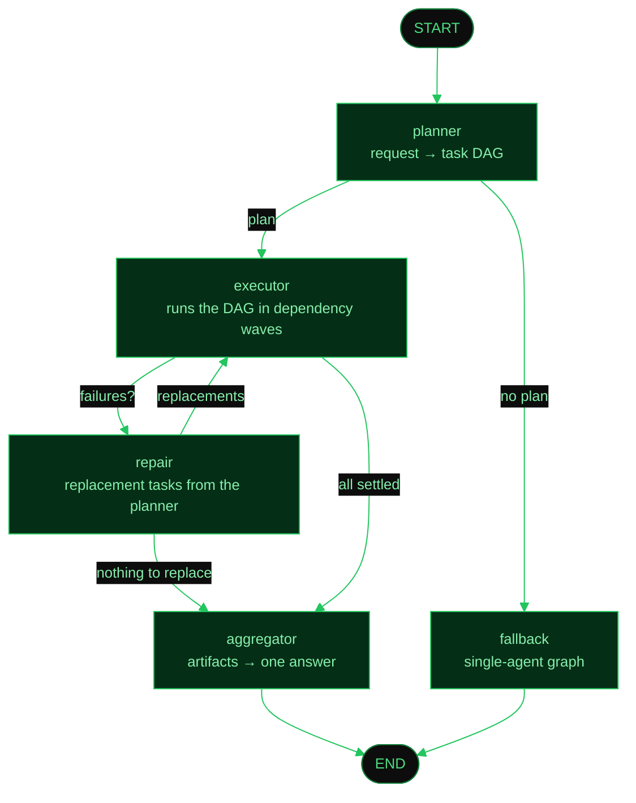

# Multi-agent orchestration (A2A)

How NOVA splits one request across specialised agents, what stops a run from
going in circles, and how to plug in an agent that lives somewhere else.

## The graph



The **fallback** branch matters as much as the orchestrated one. Splitting
"what time is it?" across four agents is pure overhead, so the planner is
allowed to decline — and when it does, the turn runs through exactly the graph
NOVA used before the orchestrator existed. A plan of fewer than two tasks is
treated as declining.

`executor → repair → executor` is the only cycle. `MAX_REPAIR_ROUNDS`
(`agent/orchestrator.py`) terminates it: once the repair budget is spent the
run answers with whatever it has, failures included.

## The agents

| Agent | Skills | Needs |
| --- | --- | --- |
| `research` | `web.research`, `knowledge.search` | nothing |
| `advisor` | `advice.generate`, `text.summarise` | nothing (reasoning only, no tools) |
| `calendar` | `calendar.schedule`, `calendar.read` | Google or Microsoft |
| `mail` | `mail.read`, `mail.search`, `mail.send` | Google or Microsoft |
| `docs` | `docs.write`, `sheets.write`, `drive.read` | Google or Microsoft |
| `github` | `github.repos`, `github.issues`, `github.activity` | GitHub |

An agent whose provider is not connected is never offered to the planner, so
the plan cannot contain a task nobody can carry out.

A worker can only call the tools its own spec names. That cuts both ways: a
tool bound into the graph but named by no spec is unreachable from the
orchestrator entirely — the worker never sees it, and no skill leads to it.
`test_provider_tools_are_reachable_from_some_agent` fails if a service tool
ends up in that state.

## Execution budgets

The problem a budget solves is not a crash — it is an agent that never decides
it has enough. A research worker will keep searching for as long as you let it.

Every task is bounded on four axes. Hitting a limit **does not fail the task**:
the worker stops calling tools and makes one final tool-less call to answer
from what it already gathered.

| Variable | Default | What it bounds |
| --- | --- | --- |
| `NOVA_TASK_MAX_STEPS` | 6 | LLM calls in the ReAct loop |
| `NOVA_TASK_MAX_TOOL_CALLS` | 8 | Tool invocations per task |
| `NOVA_TASK_MAX_SECONDS` | 180 | Wall clock, tools included |
| `NOVA_TASK_MAX_REPEATS` | 1 | Repeats of the *same* call before it counts as circling |

Repeat detection canonicalises the tool name and arguments, so
`"LangGraph  Release Notes"` and `"langgraph release notes"` count as the same
search — the shape a loop actually takes.

An agent may narrow these for itself but never widen them (`Budget.merge`).
The research agent ships with a tighter leash — 5 steps, 4 searches, 120s, no
repeats — because it is the one whose appetite is unbounded.

There is deliberately **no per-tool timeout**. A hung tool is already bounded
by the task's own clock — the whole worker runs under `NOVA_TASK_MAX_SECONDS`
— so it cannot stall a run; it costs that task its time budget and the agent
answers with what it had. Adding a per-tool ceiling here means wrapping each
tool, and a wrapper that does not reproduce LangChain's introspected `_arun`
signature exactly makes it withhold the `config` argument, which breaks every
tool call in the system. A genuine per-tool ceiling belongs inside the tool,
next to the client making the call.

## Failure handling

Three distinct mechanisms, for three distinct failures:

- **Retry** (`NOVA_TASK_MAX_ATTEMPTS`, default 2) — the same task, run again.
  Only for failures that look transient. A missing connection, an unknown
  skill or an exhausted budget fails identically the second time, so those are
  never retried; see `executor._is_transient`.
- **Repair** — a *different* task, from the planner, for work that failed
  because it was the wrong approach. The planner sees the error text and may
  narrow the goal or pick another skill. Returning nothing is the common and
  correct answer.
- **Skip** — a task whose dependency failed never runs. Its input does not
  exist, and a worker asked to write a document from missing research will
  invent one.

Stopping a run marks every unfinished task `canceled` and says so, rather than
leaving agents that never report back.

## Remote agents (peers)

Set `NOVA_A2A_PEERS` to a comma-separated list of base URLs. NOVA fetches each
one's `/.well-known/agent-card.json`, adds its skills to the planner's
catalogue, and dispatches matching tasks over JSON-RPC instead of running them
in-process:

```bash
NOVA_A2A_PEERS=https://acme.example,https://research.internal
```

- Skills are namespaced by peer (`acme-research.search`), so two agents cannot
  collide in the skill index.
- A peer never shadows a built-in skill. Local execution has no network to fail
  and no third party to trust, so it wins ties.
- An unreachable peer is simply absent from the catalogue: the planner never
  routes work to it, degrading the run to what NOVA can do alone.
- Cards are cached for five minutes (`registry._PEER_CACHE_SECONDS`).

NOVA is itself a peer. It serves `POST /a2a` (`message/send`) and answers as a
*single* agent — the caller gets one reply, not an org chart. Two instances can
therefore point at each other.

The seam is one field: `AgentSpec.endpoint`. Set it, and `worker.run_task`
dispatches over the wire; leave it empty and the task compiles a local graph.
Either way the orchestrator gets the same `Task` back, which is what the
protocol modelling was for.

## What a run emits

Every event carries `run_id`, the identifier of the orchestrated turn:

| Event | When |
| --- | --- |
| `plan` | The DAG, before any task runs |
| `task_start` / `task_end` | An agent picks up / finishes a task |
| `task_retry` | Before a transient failure is attempted again |
| `replan` | The planner replaced failed tasks |
| `tool_start` / `tool_end` | As each tool call happens, not afterwards |

`task_end` also carries that agent's `token_usage` and, when a budget stopped
it, a `note` explaining which ceiling was hit.

The run is stamped onto the assistant message it produced, so every reply in a
conversation keeps its own diagram across a reload — the session state only
ever holds the latest turn's plan.

## Adding an internal agent

Add a module under `nova_a2a/agents/` declaring one `AgentSpec`: id, skills,
the exact tool names it may call, and the providers it needs. The registry
picks it up, its skills enter the planner's catalogue, and the card advertises
them when its provider is connected. There is no routing table to update.

Keep the tool belt narrow. A worker that sees eight tool schemas instead of
thirty-nine has a context window that fits, which is the point of the split.
